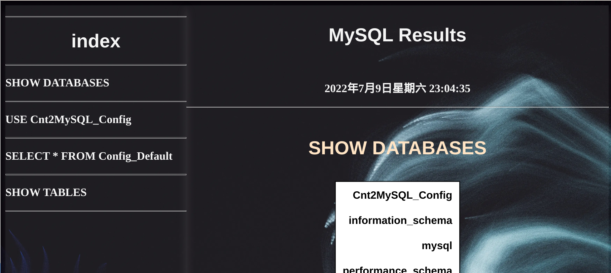

# Connect2MySQLByPython

通过 python 连接 MySQL，使用 pymysql

使用 config.ini 进行配置

使用 Pandas 一句一句地打印 MySQL 表格
可以通过 Pandas 的内置方法将表格导出为 Excel，markdown 等多种格式

## 获取方式

```bash
git clone https://github.com/PeterLiu-all/Connect2MySQLByPython.git
```

## 使用方法

### 建议先使用 setup.py 安装

```bash
# 如果是Linux系统，可以直接运行start.sh
bash start.sh
# 如果是Windows系统，就手动操作
python setup.py build && python setup.py install
# 或者直接pip install .
# 可以直接使用test.py直接检测是否安装成功
python test.py
```

```python
from Cnt2MySQL import SQL_Connect, Transformer


# filename是你自己的sql文件名
sql_obj = SQL_Connect("test.sql")
# title是你的服务器配置名
sql_obj.readConfig(title="Default")
# 连接了之后自动打印
# 请在config.ini中配置你的MySQL服务器
sql_obj.conn_mysql(sql_obj.sql_list)
```

你也可以直接使用文件夹中的 test.py 进行测试

### 将输出结果导出为其他格式

本项目的 transform.py 提供了将表格导出为 markdown、PDF、png、HTML、csv、excel 的方法（多数为 pandas 的自带方法）

### 使用方法

```python
# 在连接并获取SQL语句执行结果后
trf = Transformer(sql_obj.dfSet)
trf.to_markdown()
```

也可以直接在 test.py 测试

### 简易可视化
本模块提供了建议可视化功能，在查询完毕后会自动打开默认浏览器查看MySQL语句与对应响应。



产生的网页默认查看完毕后删除，如不想删除可以手动传入列表并将参数leave设为True
```python
into_html_sentence(sql_obj._results, sql_obj.sql_list, True)
```

同时，本模块提供了修改展示页面HTML/CSS/JSP的api接口，具体请阅读源码中函数下的说明


## 自定义服务器配置

config.ini 在没有特别使用文件名指定的时候，默认路径为当前路径
假设配置文件在./cfg/文件夹下，创建对象时就传入文件名为：

```python
# 注意Windows的分隔符不一样
sql_obj = SQL.SQL_Connect("test.sql", config="cfg/config.ini")
```

配置 config.ini

```Plain
[Default]
host:127.0.0.1
port:3306
user:root
passwd:123456
charset:utf8
```

这里的默认设置是大部分用户的默认设置，如果不想更改默认设置，就在下方加上自己的设置，并且在读取配置时改变传入的 title 参数

```Plain
[myconfig]
host:127.0.0.1
port:3307
user:PeterLiu
passwd:123456
charset:utf8
```

读取配置时：

```python
sql_obj.readConfig(title="myconfig")
```

## 将配置保存在本地 MySQL 数据库中

test.py:

```python
# 上传当前配置
sql_obj.uploadConfig2MySQL()
# 下载数据库中全部配置
sql_obj.downloadConfig("config.ini.tmp")
```

## 异步提交 SQL 语句

使用 asyncio 实现异步（其实性能并没有提升太多）

```python
loop = asyncio.get_event_loop()
loop.run_until_complete(sql_obj.conn_mysql_async(sql_list))
```

方法 con_mysql_async 和原本的 conn_mysql 参数列表相同

具体可以查看 test_async.py
